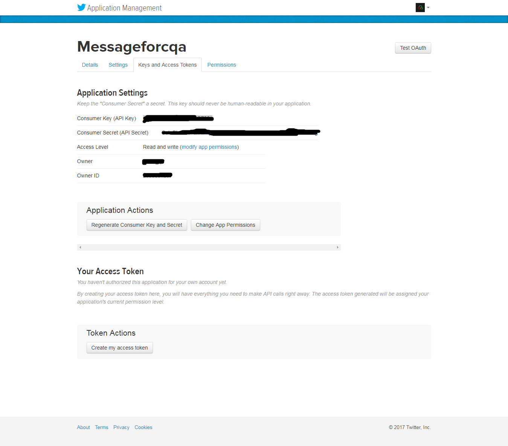

# Twitter bot to auto send a direct message after following 

## How to get Twitter API Keys

1. Login into your twitter account and go to `https://apps.twitter.com` 
2. Next click on create new app button

3. Next enter app name and other details

4. Next we can see our app details

5. Next click on `Generate Access tokens` to get the app access tokens 


## Usage:

### create a Javascript file in `config` folder name it `twitter-keys.js` 
* Next add the following snippet to configure Twitter API keys.
* A sample file is included to get started in `/config/twitter-keys.sample.js`

```javascript
module.exports = {
  consumer_key:         '...',
  consumer_secret:      '...',
  access_token:         '...',
  access_token_secret:  '...',
  timeout_ms:           60*1000,  // optional HTTP request timeout to apply to all requests.
};

```

# Running 

```shell
yarn install

yarn run start

```
License
=======

Javascript Twitter Tools are released under an MIT License.